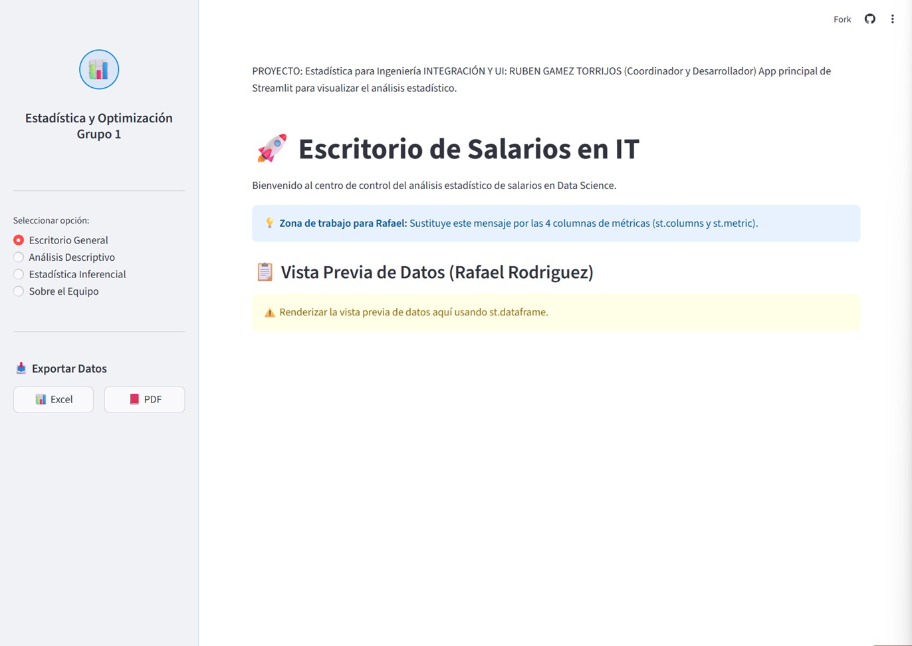
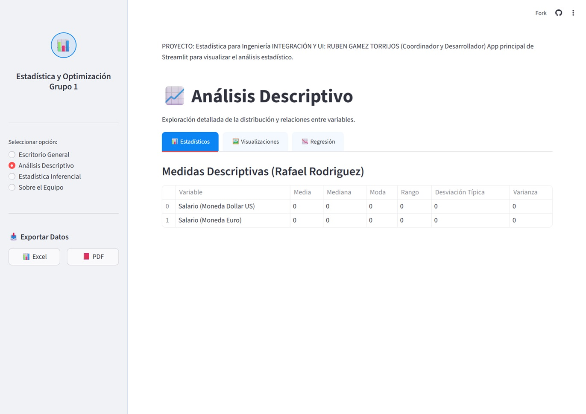
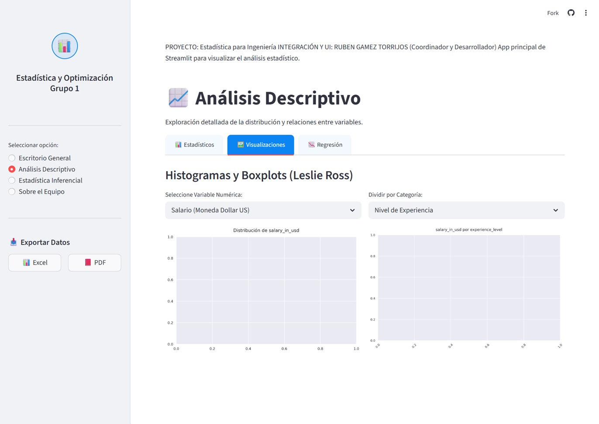
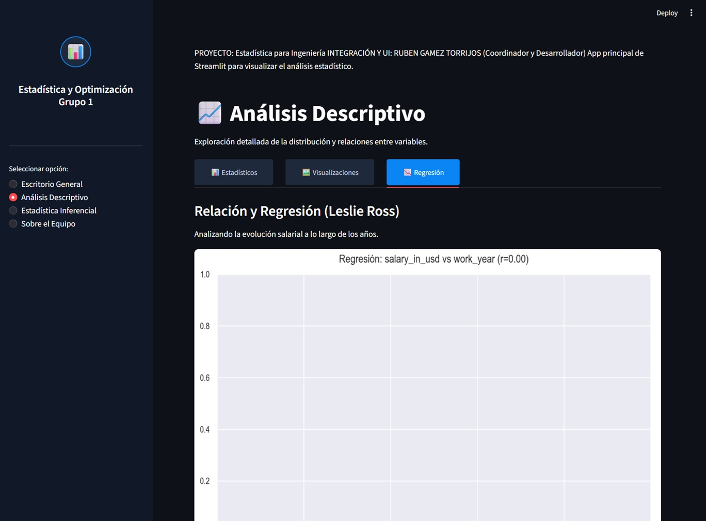
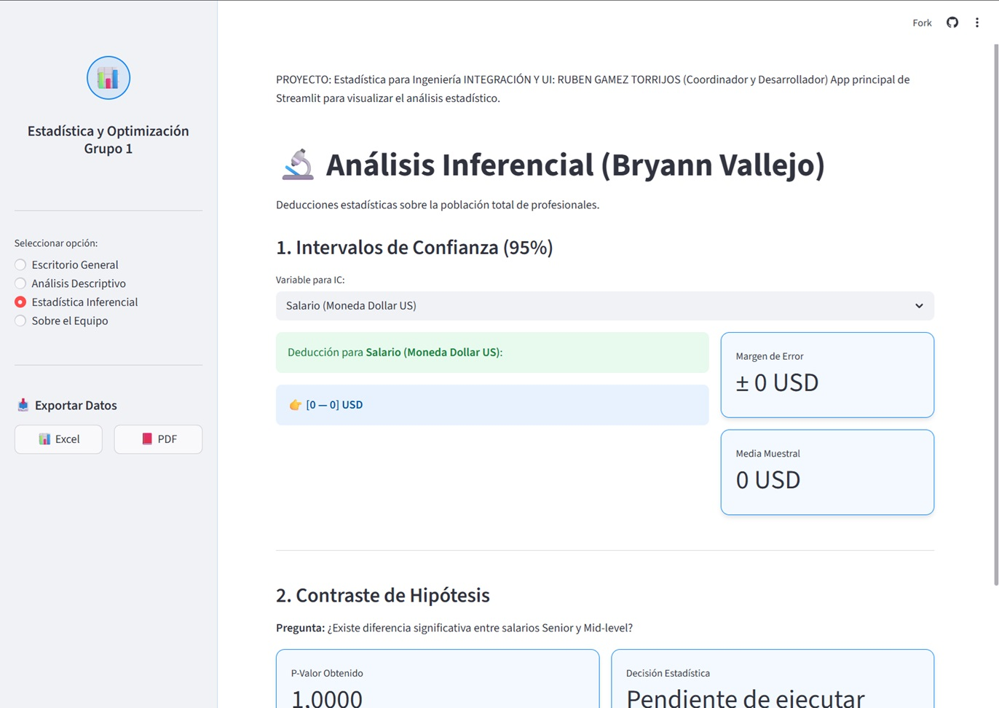
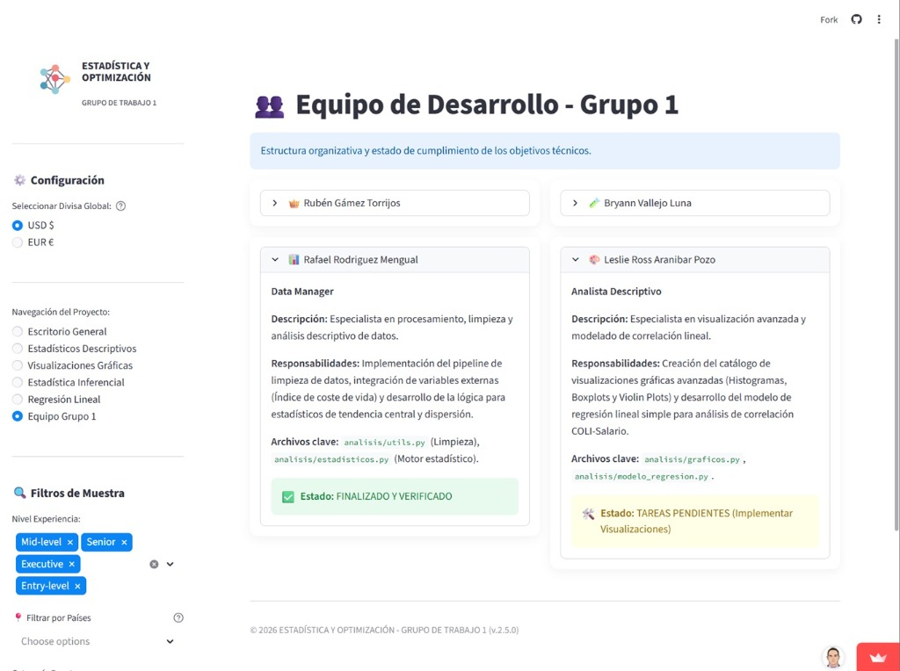

# 🛠️ Entorno de Desarrollo - Grupo 1 (Estadística y Optimización)

## ⚠️ AVISO PARA EL EQUIPO
Este repositorio está configurado como la **base de desarrollo (SKELETON)**. La arquitectura del proyecto, la integración de la interfaz (Streamlit) y el motor de formateo ya ha sido desarrollado.

**Vuestro objetivo es completar la lógica estadística de los archivos asignados para que el proyecto sea 100% funcional.**

---

## 🚀 Cómo empezar a trabajar en Local

1. **Requisito de Python**: Se requiere **Python 3.9 o superior** (Recomendado: **3.12**).
2. **Clonar la rama de desarrollo**:
   ```bash
   git clone -b dev https://github.com/RubenGamezTorrijos/EstadisticaGrupo1.git
   cd proyecto_estadistica
   ```

3. **Instalar dependencias**:
   ```bash
   pip install -r requirements.txt
   ```

4. **Activar entorno virtual**:
   ```bash
   .venv\Scripts\activate
   ```
   > [!IMPORTANT]
   >Si no tienes un entorno virtual, créalo con `python -m venv .venv` y actívalo con `.venv\Scripts\activate`

5. **Ejecutar la App (para ver cambios en tiempo real)**:
   ```bash
   streamlit run app.py
   ```
   > [!WARNING]
   > Inicialmente veréis advertencias amarillas en la app.
   > Estas desaparecerán a medida que completéis vuestro código.*

---

## 📝 Equipo y Asignación de Archivos

| Integrante | Rol | Archivos Desarrollados |
| :--- | :--- | :--- |
| **Rafael Rodriguez** | Data Manager | `analisis/estadisticos.py`, archivos CSV en `datos/` |
| **Bryann Vallejo** | Analista Inferencial | `analisis/inferencial.py`, tablas CSV en `outputs/tablas/` |
| **Leslie Ross** | Analista y Visualización | `analisis/graficos.py`, `generate_plots.py`, gráficos PNG en `outputs/graficos/` |
| **Ruben Gamez** | Coordinación y Desarrollo | `app.py`, `setup_data.py`, `requirements.txt`, `.gitignore` |

### Detalle de Tareas:

#### 1. Rafael Rodriguez
*   **Lógica**: Implementar limpieza de datos y estadísticos (media, mediana, moda, etc.) en `analisis/estadisticos.py`.
*   **UI**: Reconstruir la visualización de métricas en la sección "Escritorio General" de `app.py`.

#### 2. Bryann Vallejo
*   **Inferencia**: Implementar Intervalos de Confianza (95%) y T-tests en `analisis/inferencial.py`.
*   **Output**: Asegurar la correcta generación de tablas de resultados en `outputs/tablas/`.

#### 3. Leslie Ross
*   **Gráficos**: Desarrollar funciones para Histogramas, Boxplots y Regresión en `analisis/graficos.py`.
*   **Scripts**: Mantener `generate_plots.py` para la generación masiva de recursos visuales.

---

## 📸 Capturas de la Aplicación

| Escritorio General | Estadísticos Descriptivos |
| :---: | :---: |
|  |  |
| **Visualizaciones** | **Regresión Lineal** |
|  |  |
| **Estadística Inferencial** | **Equipo Grupo 1** |
|  |  |

---

## 🏛️ Reglas del Proyecto
*   **No modificar `app.py`** fuera de las zonas marcadas, salvo autorización del Coordinador.
*   **Formato**: Mantened el estilo de codificación y usad comentarios para explicar vuestras fórmulas.
*   **Commits**: Realizad mensajes de commit descriptivos (ej: `feat(stats): implementada limpieza de outliers`).

---
*Cualquier duda técnica, consultad con el Coordinador (Rubén Gámez).*

