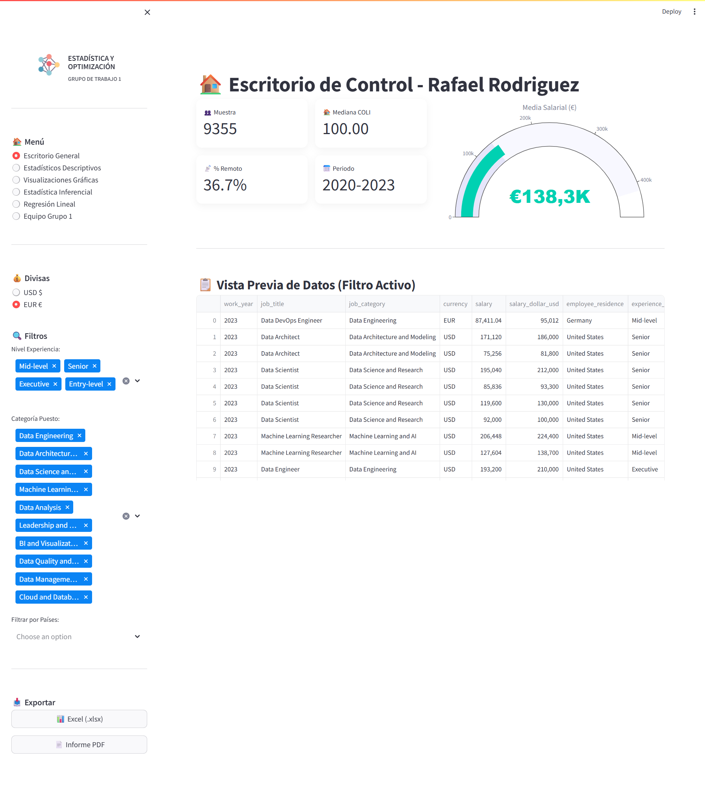
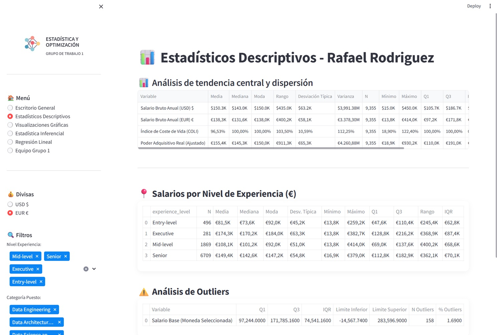
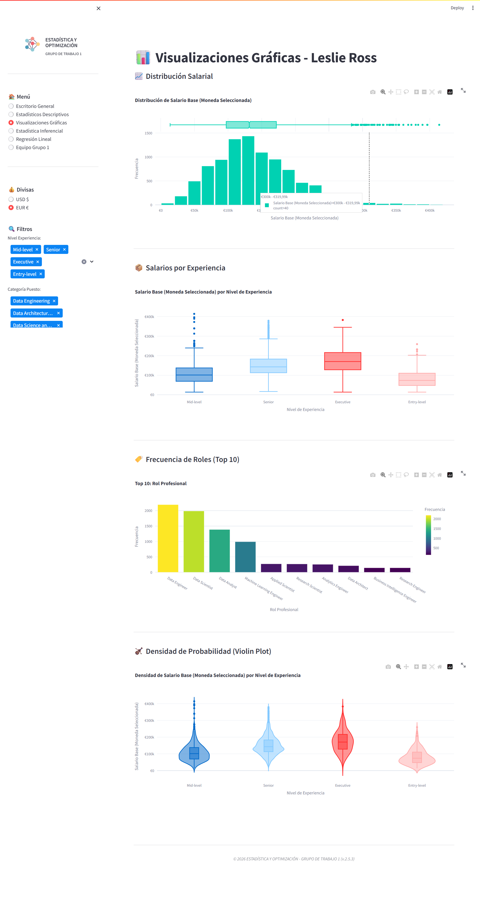
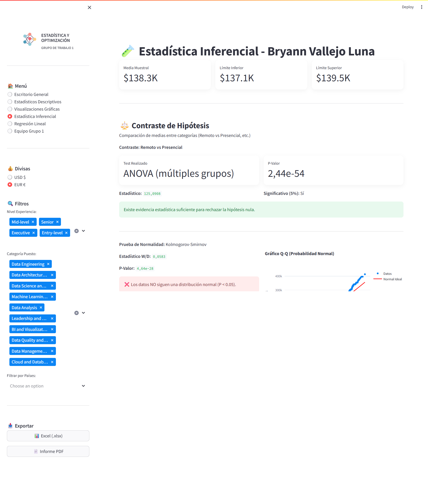
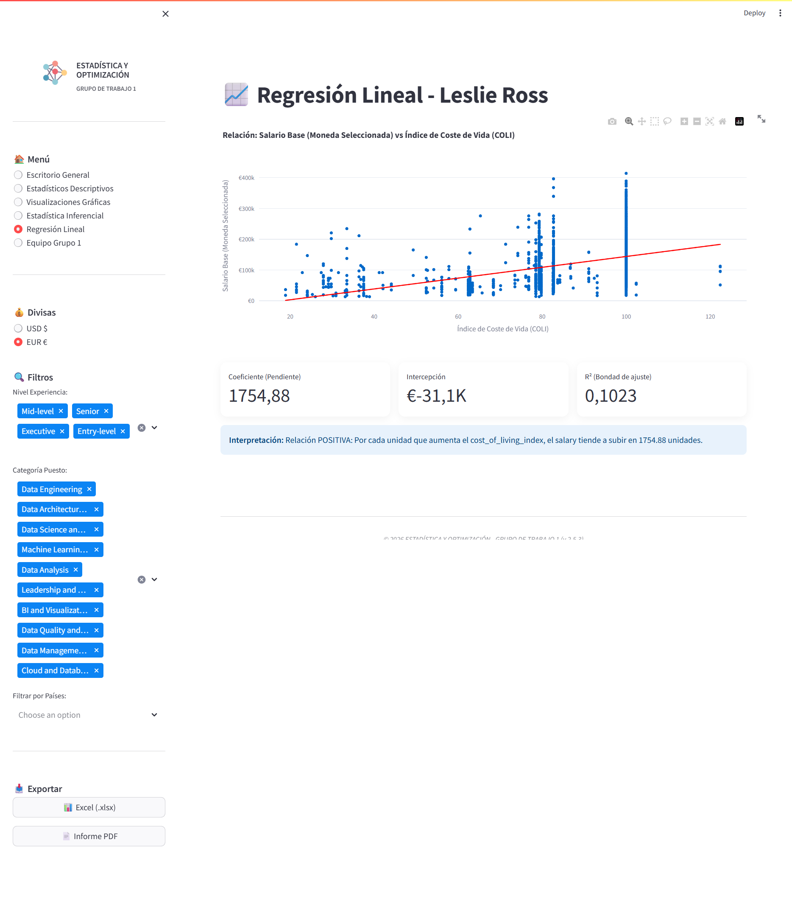
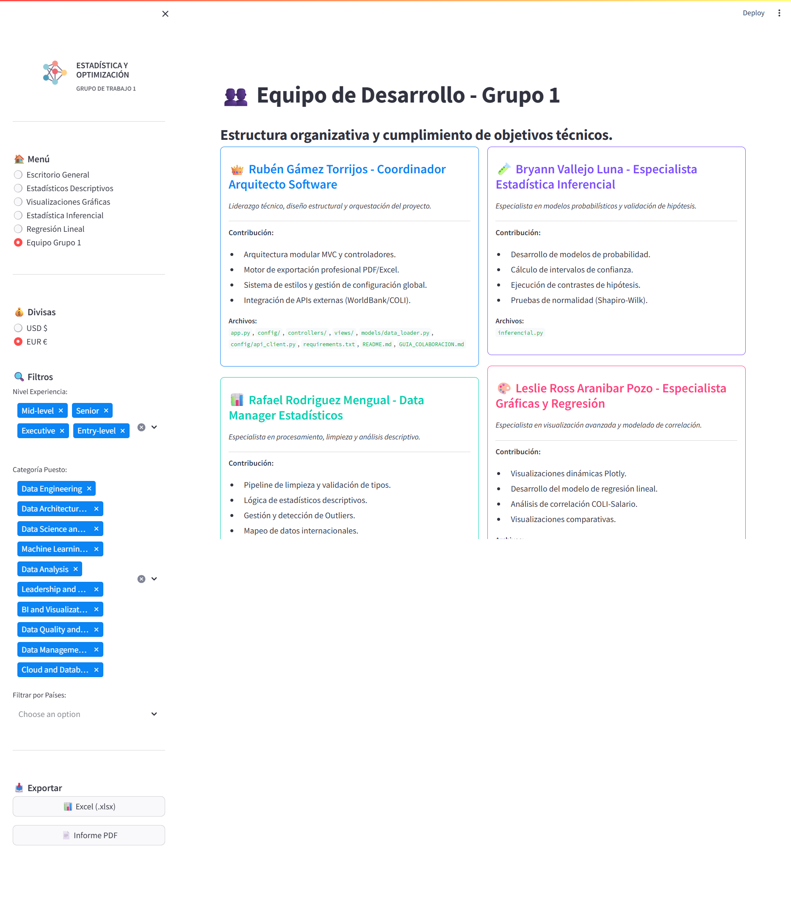

# 🛠️ Entorno de Desarrollo v.2.5.3 - Grupo 1 (Estadística y Optimización)

## ⚠️ AVISO PARA EL EQUIPO (Modo Validación y Verificación v.2.5.3")
Este repositorio ha evolucionado a una **Arquitectura Modular Estricta**. El núcleo de la aplicación, el motor de exportación y la limpieza de datos están **FINALIZADOS**.

**OBJETIVO VERIFICACIÓN:** La aplicación se encuentra en "Modo Validación Datos" y se ha finalizado el diseño y desarrollo de las funciones matemáticas y visuales de la aplicación. por lo que se debe verificar que los datos se muestran correctamente, que las funciones matemáticas realizan los cálculos correctos y que las visualizaciones son las adecuadas.

---

## 👥 Equipo y Roles Técnicos (Grupo 1)

### 👤 Rubén Gámez Torrijos (Coordinador Arquitecto Software)
- [x] **Arquitectura Core**: Diseño modular MVC y orquestación en `app.py`.
- [x] **Motor de Datos**: Pipeline de procesamiento en `models/data_loader.py` e integración API en `config/api_client.py`.
- [x] **Exportación Pro**: Motor de reportes PDF/Excel con validación de datos.
- [x] **Identidad Visual**: Diseño de la interfaz, estilos y experiencia de usuario (UX).
- [x] **Estado**: ✅ FINALIZADO (v.2.5.3).

### 👤 Rafael Rodriguez Mengual (Data Manager)
- [x] **Estadística Descriptiva**: Motor de cálculos en `analisis/estadisticos.py`.
- [x] **Análisis de Dispersión**: Medidas de tendencia central y variabilidad.
- [x] **Gestión de Outliers**: Detección profesional mediante IQR.
- [x] **Estado**: ✅ FINALIZADO Y VERIFICADO.

### 👤 Bryann Vallejo Luna (Especialista Inferencial)
- [x] **Intervalos de Confianza**: Implementación de IC 95% en `analisis/inferencial.py`.
- [x] **Contrastes de Hipótesis**: Tests paramétricos para categorías críticas.
- [x] **Validación Normicidad**: Implementación de Shapiro-Wilk y Q-Q plots.
- [x] **Estado**: ✅ FINALIZADO Y VERIFICADO.

### 👤 Leslie Ross Aranibar Pozo (Especialista Descriptivo)
- [x] **Visualizaciones**: Catálogo de Histogramas, Boxplots y Violines en `analisis/graficos.py`.
- [x] **Correlación**: Desarrollo del modelo de regresión lineal simple y R² en `analisis/modelo_regresion.py`.
- [x] **Estado**: ✅ FINALIZADO Y VERIFICADO.

---

## 🚀 Cómo empezar en esta versión (v.2.5.3)

1. **Clonar la rama de desarrollo**:
   ```bash
   git clone -b dev https://github.com/RubenGamezTorrijos/EstadisticaGrupo1.git
   cd proyecto_estadistica
   ```

2. **Instalar dependencias**:
   ```bash
   pip install -r requirements.txt
   ```

3. **Ejecutar la Aplicación Final**:
   ```bash
   python -m streamlit run app.py
   ```

> [!IMPORTANT]
> Esta versión (v.2.5.3) ya incluye la integración final de todos los módulos. Los cuadros de "pistas" han sido sustituidos por resultados reales y verificados.

---

## 📝 Asignación de Módulos (Estructura Modular)

| Módulo | Responsable | Archivo Principal | Estado |
| :--- | :--- | :--- | :--- |
| **Arquitectura / UI** | Rubén Gámez | `app.py` | ✅ Finalizado |
| **Motor Exportación** | Rubén Gámez | `analisis/exportacion.py` | ✅ Finalizado |
| **Procesamiento Datos**| Rafael Rodriguez | `config/utils.py` | ✅ Finalizado |
| **Motor Estadístico**| Rafael Rodriguez | `analisis/estadisticos.py`| ✅ Finalizado |
| **Inferencia** | Bryann Vallejo | `analisis/inferencial.py` | ✅ Finalizado |
| **Gráficos y Regresión**| Leslie Ross | `analisis/graficos.py` | ✅ Integrado |

---

## 📸 Capturas de la Aplicación

| Escritorio General | Estadísticos Descriptivos |
| :---: | :---: |
|  |  |
| **Visualizaciones** | **Regresión** |
|  |  |
| **Estadística Inferencial** | **Equipo del Grupo 1** |
|  |  |

---

## 🏛️ Reglas de Colaboración
*   **Código Limpio**: No borréis la estructura definida; completad dentro de las funciones.
*   **Docstrings**: Las funciones deben llevar la explicación de qué cálculo matemático realizan.
*   **Testing**: Verificad que vuestros cambios no rompan la generación del Informe PDF.

---
> [!CAUTION]
> Versión coordinada por **Rubén Gámez Torrijos**. No fusionar a `main` sin aprobación previa del esquema de integración.

---
*© 2026 - Universidad Europea - Grado en Ingeniería - v.2.5.3-dev*